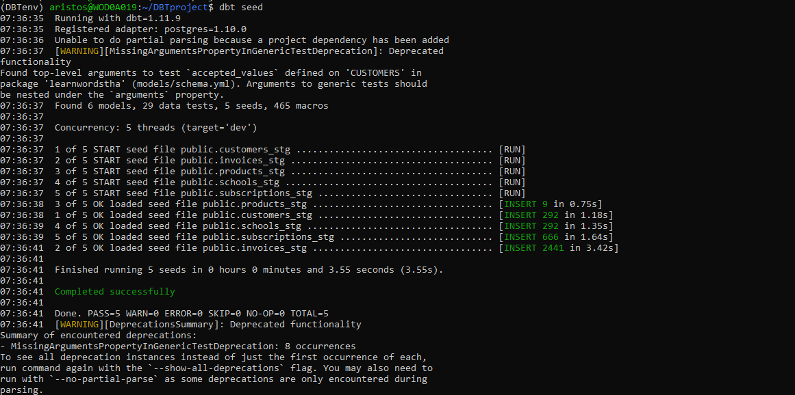
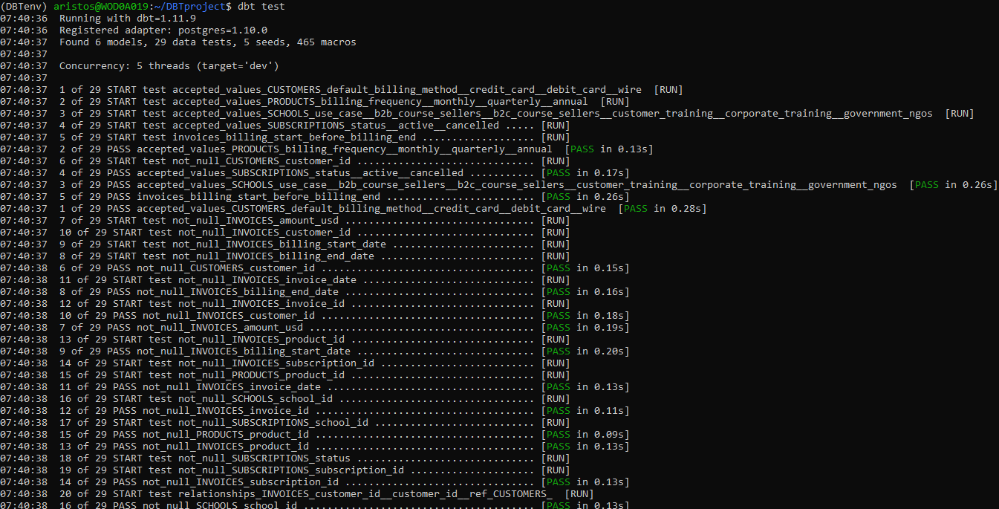
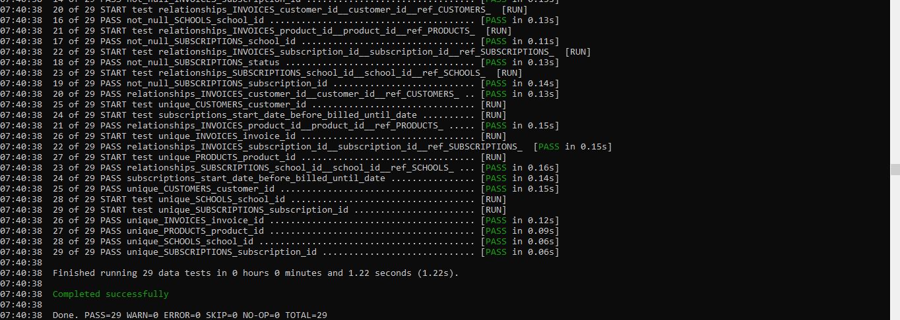
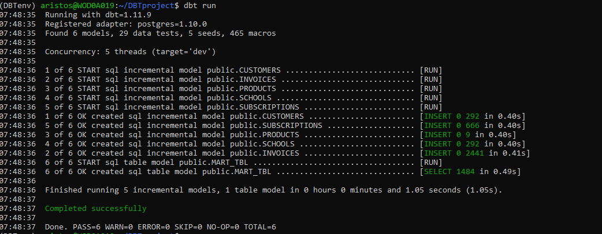
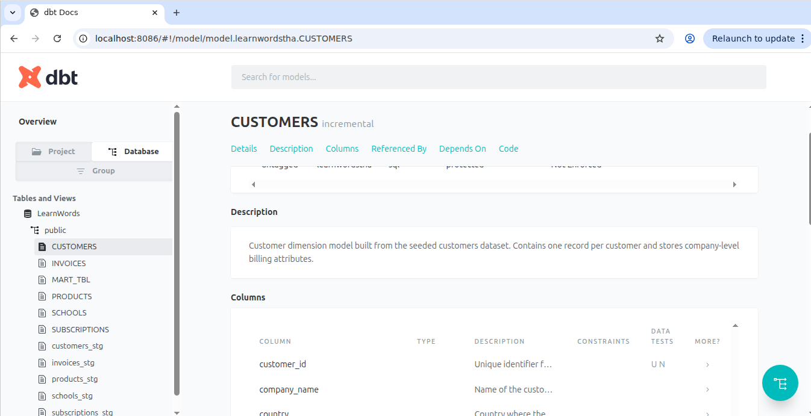

# LearnWords Take Home Assignment Project

## Scope

Demo project to imitate a realistic, hands-on problem reflecting the kind of work of a LearnWords Analytics Engineer.

## Assumptions

- The dbt project was created locally in Windows WSL (`Ubuntu 24.04.3 LTS`) in a newly created Python virtual environment dedicated to this assignment.
- Materialization of the staging layers and final mart table took place in a pre-existing local PostgreSQL instance running on port `5432`.
- The database used is called `LearnWords`.
- Other RDBMS engines can be supported by installing the respective dbt adapter and updating the connection profile in `profiles.yml`.
- Creating a Dockerized PostgreSQL instance is out of scope for this demo.
- Time limitations applied.
- The project was structured to support repeated runs with seeds containing new and updated records for entities such as invoices and subscriptions.
- Slowly Changing Dimensions (SCD) are not included, as they are out of scope for this demo.
- The final mart includes core analysis dimensions only; additional dimensions could be added depending on the reporting requirements.

## Project Structure

```text
LearnWordsTHA/
├── analyses/
├── macros/
├── models/
│   ├── CUSTOMERS.sql
│   ├── INVOICES.sql
│   ├── MART_TBL.sql
│   ├── PRODUCTS.sql
│   ├── SCHOOLS.sql
│   ├── SUBSCRIPTIONS.sql
│   └── schema.yml
├── seeds/
│   ├── customers.csv
│   ├── invoices.csv
│   ├── products.csv
│   ├── schools.csv
│   ├── subscriptions.csv
│   └── properties.yml
├── snapshots/
├── tests/
├── images/
│   ├── dbt_seed.png
│   ├── dbt_test.png
│   ├── dbt_run.png
│   └── dbt_docs.png
├── dbt_project.yml
├── profiles.yml
└── README.md
```

## Setup Steps

### 1. Clone the project from GitHub

From your home directory (mine was /home/aristos/)

```bash
cd /home/aristos/
git clone git@github.com:aristoskapnias/LearnWordsTHA.git LearnWordsTHA
```

### 2. Create the dbt profile directory

```bash
mkdir -p ~/.dbt
```

### 3. Copy `profiles.yml` into the dbt profile directory

```bash
cp LearnWordsTHA/profiles.yml ~/.dbt/
```

### 4. Create and activate a Python virtual environment

```bash
python3 -m venv DBTenv
source DBTenv/bin/activate
```

### 5. Install dbt dependencies

```bash
pip install dbt-core==1.11.9
pip install dbt-postgres==1.10.0
```

### 6. Move into the project folder

```bash
cd LearnWordsTHA
```

## Run the Project

### 1. Seed the raw CSV data into PostgreSQL

Run `dbt seed` to load the `.csv` files from the `seeds/` folder into PostgreSQL as raw/staging seed tables.

```bash
dbt seed
```



### 2. Run data quality tests

Run `dbt test` to validate:

- primary/business key uniqueness
- non-null constraints
- referential integrity
- accepted values
- custom SQL tests for business date logic

```bash
dbt test
```




### 3. Build the models

Run `dbt run` to materialize the staging entities and the final mart table.

```bash
dbt run
```



## dbt Documentation

Generate project documentation with:

```bash
dbt docs generate
```

Serve the docs locally with:

```bash
dbt docs serve --port 8086
```




## Final Output

The project produces a final reporting mart table:

- `MART_TBL`

This mart combines:

- invoices
- subscriptions
- schools
- customers

to provide monthly recurring revenue by:

- school use case
- customer country
- calendar month


## Author

Aristos Kapnias